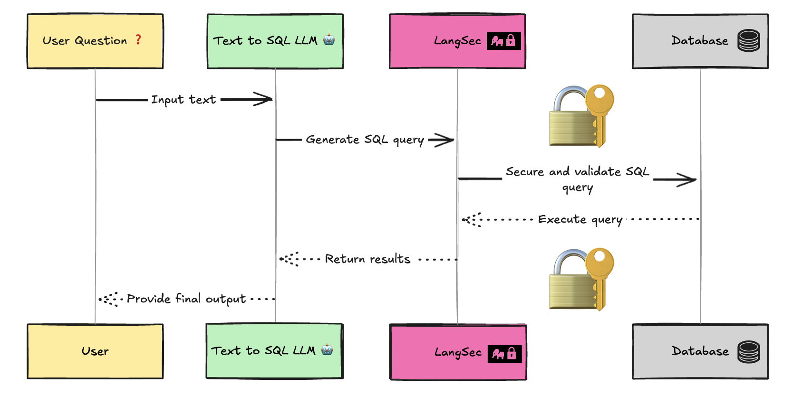

[](https://github.com/langsec-ai/langsec/releases)
[](https://img.shields.io/github/license/langsec-ai/langsec)
[](https://github.com/langsec-ai/langsec/stargazers)


# LangSec: A Security Framework for Text-to-SQL
A security framework for validating and securing LLM-generated SQL queries. LangSec helps prevent SQL injection, unauthorized access, and other security vulnerabilities when working with language models that generate SQL.


Demonstration of making a malicious query using [Vanna](https://github.com/vanna-ai/vanna).
LangSec helps prevent such attacks by validating generated queries against a security schema.



## Installation

```bash
pip install langsec
```

## Quick Start

```python
from langsec import SQLSecurityGuard
from langsec.models.schema import SecuritySchema, TableSchema, ColumnSchema
from langsec.models.enums import ColumnAccess

# Define your security schema
schema = SecuritySchema(
    tables={
        "users": TableSchema(
            columns={
                "id": ColumnSchema(access=ColumnAccess.READ),
                "username": ColumnSchema(access=ColumnAccess.READ),
                "email": ColumnSchema(access=ColumnAccess.DENIED),
            }
        )
    }
)

# Create security guard
guard = SQLSecurityGuard(schema=schema)

# Validate queries
try:
    # This will pass
    guard.validate_query("SELECT id, username FROM users WHERE id = 1")
    
    # This will raise ColumnAccessError
    guard.validate_query("SELECT email FROM users")
except Exception as e:
    print(f"Query validation failed: {e}")
```

## Configuration

### Security Schema

The security schema defines what operations are allowed on your database:

```python
from langsec.models.schema import SecuritySchema, TableSchema, ColumnSchema, JoinRule
from langsec.models.enums import ColumnAccess, JoinType, AggregationType

schema = SecuritySchema(
    tables={
        "users": TableSchema(
            columns={
                "id": ColumnSchema(access=ColumnAccess.READ),
                "username": ColumnSchema(access=ColumnAccess.READ),
                "email": ColumnSchema(access=ColumnAccess.DENIED),
                "created_at": ColumnSchema(access=ColumnAccess.READ),
            },
            require_where_clause=True,
            allowed_joins={
                "orders": JoinRule(allowed_types={JoinType.INNER, JoinType.LEFT})
            },
        ),
        "orders": TableSchema(
            columns={
                "id": ColumnSchema(access=ColumnAccess.READ),
                "amount": ColumnSchema(
                    access=ColumnAccess.READ,
                    allowed_aggregations={AggregationType.SUM, AggregationType.AVG},
                ),
            }
        ),
    },
    max_joins=2,
    allow_subqueries=True,
    max_query_length=500,
    forbidden_keywords={"DROP", "DELETE", "TRUNCATE"},
)
```

## Advanced Usage

### Working with Table Aliases

LangSec handles table aliases transparently:

```python
# These queries are equivalent
guard.validate_query("SELECT users.username FROM users")
guard.validate_query("SELECT u.username FROM users u")
```

### Subqueries

Control subquery usage:

```python
schema = SecuritySchema(
    tables={...},
    allow_subqueries=True  # Enable/disable subqueries
)
```

## Integration with LLMs

Example using LangSec with OpenAI:

```python
from openai import OpenAI
from langsec import SQLSecurityGuard

client = OpenAI()
guard = SQLSecurityGuard(schema=your_schema)

def get_safe_sql(prompt: str) -> str:
    response = client.chat.completions.create(
        model="gpt-3.5-turbo",
        messages=[
            {"role": "system", "content": "You are a SQL query generator."},
            {"role": "user", "content": prompt}
        ]
    )
    
    query = response.choices[0].message.content
    
    # Validate query before execution
    try:
        guard.validate_query(query)
        return query
    except Exception as e:
        raise ValueError(f"Generated query is not safe: {e}")
```

## Contributing

Contributions are welcome! Please feel free to submit a Pull Request.

## License

APACHE 2.0 © 2024 LangSec

## Support

For issues and feature requests, please create an issue on GitHub or contact dev@lang-sec.com.